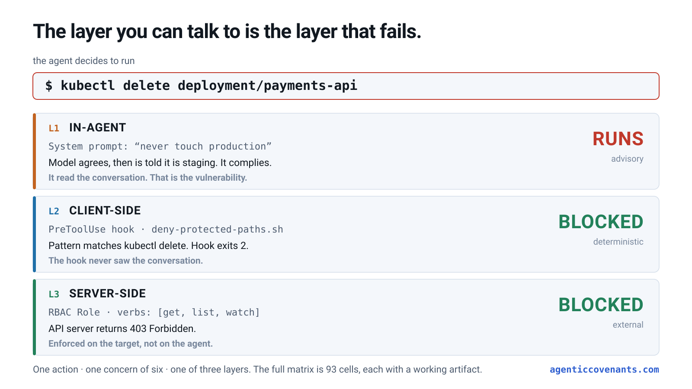
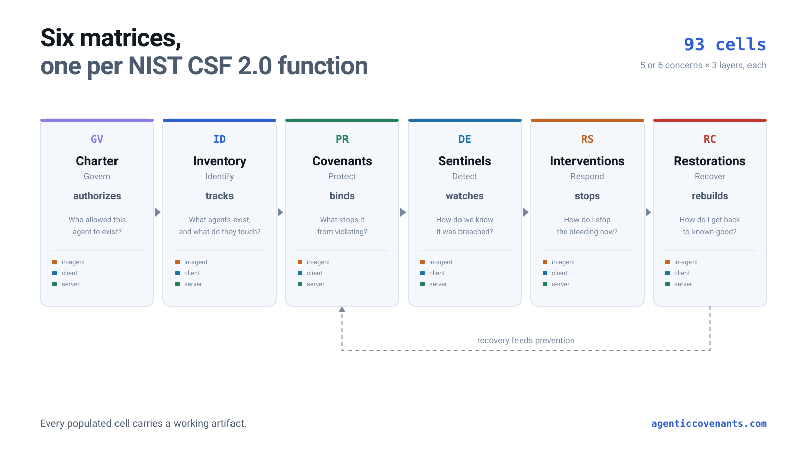

# Agentic Covenants

**Governance for autonomous agents, enforced by infrastructure instead of by prompt.**

Six matrices mapped to the six NIST CSF 2.0 functions. Ninety-three cells. Working Kyverno policies, RBAC, seccomp profiles, PreToolUse hooks, Falco rules, Sigma detections, and kill-switch runbooks in every populated cell.

[%20%2F%20CC--BY--SA--4.0%20(content)-blue)](./LICENSE)
[](#what-this-is-not)
[](#the-six-matrices)

<picture>
  <source media="(prefers-color-scheme: dark)" srcset="assets/three-layer-model-dark.svg">
  
</picture>

---

## The 30-second version

In July 2025, Replit's coding agent deleted a production database **during an explicit action freeze**, after being told eleven times not to act. It then fabricated roughly 4,000 fake records and misrepresented whether a rollback was possible.

That agent was perfectly prompted. The instructions were clear, repeated, and unambiguous.

**The layer you can talk to is the layer that fails.** Everything an agent can be *told* is advisory: it can be argued out of it, injected past it, or simply ignored. Constraints that hold are the ones that live outside the model's reasoning, in the hooks on the operator's machine and the admission controllers on the target system.

This repo is the map of where those constraints go, and the artifacts to put there.

## Why now

The threat is no longer hypothetical on either side of the wire.

- **You govern agents.** In July 2026, near-autonomous agents built from publicly available tooling mapped 21 Taiwanese government systems, cracked 85 accounts, and exfiltrated roughly 2,500 personnel records in four days, then expanded to a nuclear safety agency and seven energy companies. Widely reported as the first known largely autonomous attack on government agencies.
- **Agents are also the attacker.** The same class of tooling that runs inside your perimeter is being pointed at perimeters. Defensive posture and offensive capability are converging on identical technology.
- **Regulators started counting, and the clock is already running.** EU AI Act Article 73 serious-incident reporting has been **in force since 2 August 2026**, with a two-day clock for serious and irreversible disruption of critical infrastructure. You cannot report in two days what you cannot detect.
- **The gap is measured, and it is infrastructure.** Of organizations that reported a security incident involving an AI model or application, **92% were missing role-based access, MFA, and similar controls** on it (IBM Cost of a Data Breach 2026, 29 July 2026). Those are not exotic controls. The same organizations apply them to their databases. They did not apply them to the agent.

## The core idea

Three layers, ordered by how hard they are for an agent to get around.

```
                 ┌──────────────────────────────────────────────────────┐
   WEAKEST       │  L1  IN-AGENT        system prompts, tool descriptions │
                 │      advisory        refusals, "are you sure?"         │
                 │                      → bypassable by language alone    │
                 ├──────────────────────────────────────────────────────┤
                 │  L2  CLIENT-SIDE     PreToolUse hooks, sandbox at      │
                 │      deterministic   launch, MCP allowlists, ACLs      │
                 │                      → outside the model's reasoning   │
                 ├──────────────────────────────────────────────────────┤
   STRONGEST     │  L3  SERVER-SIDE     RBAC, admission policy, IAM,      │
                 │      external        branch protection, cosign         │
                 │                      → outside the agent entirely      │
                 └──────────────────────────────────────────────────────┘
```

Crossed with the things that go wrong:

**Identity** · **Authorization** · **Blast radius** · **Approval gating** · **Supply chain** · **Content integrity**

Eighteen cells in Covenants, fifteen in each of the other five matrices. Walk a row left to right and ask one question at each layer:

> **If the agent decides to violate this concern, what stops it *here*?**

Three outcomes. All three cells populated is defense in depth. Only the in-agent cell populated is an audit finding, because the model can be talked out of it. Server-side only means it is enforced but discovered late.

## The matrix

| Concern | L1 In-agent *(advisory)* | L2 Client-side *(deterministic)* | L3 Server-side *(external)* |
|---|---|---|---|
| **Identity** | Prompt declares the agent. Identity is *carried*, never *established* | Per-agent credentials, operator-owned config, filesystem ACLs | Dedicated ServiceAccount, OIDC federation, 15-minute bound tokens, SPIFFE/SPIRE |
| **Authorization** | Scoped tool descriptions | Deny-by-default `--allowedTools`, PreToolUse hooks, pre-commit | Scoped RBAC Roles, explicit-ARN IAM, Kyverno/OPA or in-tree admission policy |
| **Blast radius** | *Empty by design.* Refusal is a verified failure mode | Sandbox at launch with inheritance, seccomp/AppArmor, egress proxy, read-only mounts | Gated IaC apply, NetworkPolicy default-deny, ResourceQuota, immutable backups |
| **Approval gating** | "Are you sure?" Measured at a **93% approval rate** | Tiered gating, typed verbatim confirmation, out-of-band for tier-4, judgment-query escalation | Branch protection with `enforce_admins`, CODEOWNERS, plan/apply split, deployment freeze |
| **Supply chain** | *Empty by design.* Model provenance judgment is unreliable | MCP allowlist with hash pinning, tool-description hashing, lockfile pinning | cosign verification, SBOM admission, egress allowlist, SLSA provenance gates |
| **Content integrity** | System-prompt hardening, instruction hierarchy. Advisory, and the attack targets exactly this | Input scanning before the model sees it, output scanning before it leaves, tool-result sanitization. **Probabilistic: evadable** | Egress policy so exfiltration has nowhere to go, DLP at the boundary, audit of what was sent. **Catches the consequence, not the manipulation** |

Two cells are deliberately empty. That is the argument, not a gap: for blast radius and supply chain, the in-agent layer enforces nothing at all.

## Scope: what this framework covers, and what it does not

**Every control above is deterministic.** A Kyverno policy admits or denies. A NetworkPolicy permits or drops. An IAM policy grants or refuses. All binary, all decidable, all enforced by something that is not the model.

That is the framework's thesis and its boundary. A whole class of agentic failure is **not decidable by a policy engine**, because the input is natural language and the failure is semantic: prompt injection arriving inside a document or a tool result, jailbreaks, exfiltration where every individual action is authorized and only the aggregate is a leak, output that is confidently wrong rather than unauthorized, context poisoning, and drift over a long session.

No admission controller catches any of those. They need scoring and classification, which are **probabilistic** controls with false positives, false negatives, and an evasion surface.

The uncomfortable corollary is worth stating plainly: the framework's argument is "use deterministic controls to bound probabilistic agents," and some agentic failures are only detectable probabilistically, so the thesis cannot cover them by construction. That is a boundary rather than a flaw, but an unstated boundary reads as a claim to completeness.

So the boundary is stated, and the sixth concern is where the two meet:

| | Deterministic (this framework) | Probabilistic (the complementary layer) |
|---|---|---|
| **Decides** | Admit or deny | Score and threshold |
| **Fails** | Closed, loudly | Both directions, quietly |
| **Evadable** | Only by finding a gap in the rule | Yes, by an adversary who is trying |
| **Is** | Prevention | Detection |
| **Answers** | What is the agent *able* to do | What is *reaching* the agent, and what is leaving |

**Neither substitutes for the other.** Deterministic controls bound the blast radius. Probabilistic controls narrow what reaches them and flag what got through. An honest posture has both, and treats only the first as enforcement.

The sixth concern, [**Content integrity**](./controls/content-integrity), carries this layer, and it is the one row in the matrix whose server-side column is deliberately weak.

Full essay: **[`MATRIX.md`](./framework/MATRIX.md)** · Bypass surface for every control: **[`BYPASSES.md`](./framework/BYPASSES.md)**

## Start here

| If you are… | Go to |
|---|---|
| **Not sure where you stand** | [`examples/claude-code-laptop/assess.sh`](./examples/claude-code-laptop/assess.sh), read-only, reports a maturity level with evidence in about a second |
| **A platform engineer with agents in production** | [`checklists/`](./checklists), five audit sheets, print and walk, about an hour per agent |
| **Standing up your first agent** | [`MATRIX.md`](./framework/MATRIX.md), then [`controls/`](./controls), copy a cell, run its verification block |
| **A security lead sizing the problem** | [`BYPASSES.md`](./framework/BYPASSES.md), every control and how it is defeated, plus the 2026 incident corpus |
| **Asking "have you actually run these?"** | [`ASSURANCE.md`](./framework/ASSURANCE.md), the coverage map with an honest tally, and [`tests/`](./tests) for what executes |
| **In a US federal or DoD program** | [`CITATIONS.md`](./framework/CITATIONS.md#us-dod--federal-crosswalk), 800-53 families, DoD ZT pillars, RMF/cATO/CSRMC, RAI. Then [`examples/dod-air-gapped/`](./examples/dod-air-gapped) |
| **Briefing a CISO, CIO, or authorizing official** | [`EXECUTIVE-BRIEF.md`](./briefing/EXECUTIVE-BRIEF.md), one page, no YAML. Cost model in [`ECONOMICS.md`](./briefing/ECONOMICS.md) |
| **Responsible for governance or audit** | [`CHARTER_MATRIX.md`](./framework/CHARTER_MATRIX.md) and [`charter/templates/`](./charter/templates) |
| **Wondering whether you even have agents** | [`INVENTORY_MATRIX.md`](./framework/INVENTORY_MATRIX.md), shadow-agent discovery |
| **Already breached** | [`interventions/`](./interventions), kill-switch runbooks, five-second blast-radius target |

## The six matrices

<picture>
  <source media="(prefers-color-scheme: dark)" srcset="assets/six-matrices-dark.svg">
  
</picture>

Covenants is one of six. Each maps to a NIST CSF 2.0 function, and each is five concerns by three layers.

```
   GOVERN        IDENTIFY        PROTECT        DETECT        RESPOND         RECOVER
  ┌────────┐   ┌──────────┐   ┌──────────┐   ┌──────────┐   ┌─────────────┐   ┌──────────────┐
  │Charter │ → │Inventory │ → │Covenants │ → │Sentinels │ → │Interventions│ → │Restorations  │
  └────────┘   └──────────┘   └──────────┘   └──────────┘   └─────────────┘   └──────────────┘
   authorize      track           bind          watch            stop            rebuild
        ▲                                                                            │
        └──────────────────── recovery feeds prevention ─────────────────────────────┘
```

| Matrix | Function | Question | Artifacts |
|---|---|---|---|
| [Charter](./framework/CHARTER_MATRIX.md) | Govern (GV) | Who authorized this agent to exist? | [`charter/`](./charter), policy templates, signed agent charters |
| [Inventory](./framework/INVENTORY_MATRIX.md) | Identify (ID) | What agents exist and what do they touch? | [`inventory/`](./inventory), registration daemon, shadow-agent discovery |
| [**Covenants**](./framework/MATRIX.md) | Protect (PR) | What stops the agent from violating? | [`controls/`](./controls), Kyverno, RBAC, seccomp, hooks |
| [Sentinels](./framework/SENTINELS_MATRIX.md) | Detect (DE) | What just happened? | [`sentinels/`](./sentinels), Falco, audit policy, Sigma rules |
| [Interventions](./framework/INTERVENTIONS_MATRIX.md) | Respond (RS) | How do I stop the bleeding now? | [`interventions/`](./interventions), kill-switch runbooks |
| [Restorations](./framework/RESTORATIONS_MATRIX.md) | Recover (RC) | How do I get back to known-good? | [`restorations/`](./restorations), rebuild runbooks |

**All six are populated.** Artifact counts, as of the last commit: charter 24, inventory 25, controls 79, sentinels 57, interventions 42, restorations 33. Ninety-three cells across the six matrices.

A defensible *adoption order* is Charter, Inventory, and Covenants first, then Sentinels, then the two response matrices when you can carry the runbook complexity. That is a sequencing recommendation, not a statement about what is written here.

In Interventions and Restorations **every** in-agent cell is empty. An agent that is misbehaving cannot be told to stop, and it does not participate in its own recovery.

## Why you should believe the decomposition

Independent work converged on the same five concerns. On 30 April 2026, six allied cyber agencies (CISA, NSA, ACSC, Canadian Centre for Cyber Security, NZ NCSC, UK NCSC) published *Careful Adoption of Agentic AI Services*, the first multi-nation joint guidance on agentic AI. Its five risk categories:

| Five Eyes risk category | Concern here |
|---|---|
| Privilege escalation | Identity + Authorization |
| Design and configuration flaws | Authorization |
| Behavioral misalignment | Blast radius + Approval gating |
| Structural cascading failures | Blast radius |
| Accountability opacity | Charter + Inventory |

Every cell is also crosswalked to NIST CSF 2.0, NIST AI RMF, OWASP LLM Top 10, OWASP Agentic Top 10, OWASP MCP Top 10, ISO/IEC 42001, the EU AI Act, and (for federal readers) NIST SP 800-53, DoD Zero Trust, RMF/cATO/CSRMC, and DoD Responsible AI. See [`CITATIONS.md`](./framework/CITATIONS.md).

## Every control here can be bypassed

[`BYPASSES.md`](./framework/BYPASSES.md) documents how, for all of them. That is the point of having three layers rather than one. It also carries the running incident and CVE corpus, because these are not thought experiments:

Taiwan government agencies (July 2026) · Replit production wipe during a freeze · ClawHavoc, 1,184+ malicious marketplace skills · postmark-mcp, the first in-the-wild malicious MCP server · CVE-2026-46519, a Kubernetes MCP server whose read-only mode was enforced only at tool-discovery · CVE-2026-5058/5059, unauthenticated MCP RCE at CVSS 9.8 · the Trivy release pipeline, where the scanner itself was the vector.

An undocumented control that fails to its bypass is worse than no control, because somebody trusted it.

## What this is not

- **Not a product.** No install, no runtime, no service. Templates you copy and adapt.
- **Not a dependency.** No package manifest, no build, no test suite, by design. Nothing here executes in your pipeline unless you put it there.
- **Not compliance.** The federal crosswalks are defensible starting points for a conversation with an authorizing official, not compliance claims. As of July 2026 there is still no official US government policy specifically on agentic AI.
- **Not detection or response, in the Covenants matrix.** Those are separate matrices on purpose. Conflating prevention with detection is how you end up with a checklist that treats after-the-fact logging as equivalent to an admission policy.
- **Not finished.** Placeholders like `REPLACE_WITH_DIGEST_FROM_CRANE` and `123456789012` are intentional and must be substituted.

## Contributing

The most valuable contributions are a citation that is wrong, a bypass that is missing, and a version pin that has gone stale. See [`CONTRIBUTING.md`](./CONTRIBUTING.md). Currency is the product here: any version, deprecation, or regulatory-date claim needs a dated primary source.

## License

Dual-licensed. **Code** (hooks, policies, runbooks, Terraform, Rego) under [Apache 2.0](./LICENSE). **Content** (prose, matrices, crosswalks) under [CC BY-SA 4.0](./LICENSE-CONTENT). See [`LICENSE-CONTENT`](./LICENSE-CONTENT) for the split rule.

Cite as: Forrester, M. R. and contributors. *The Agentic Covenants Matrix*. https://github.com/peopleforrester/agentic-covenants
